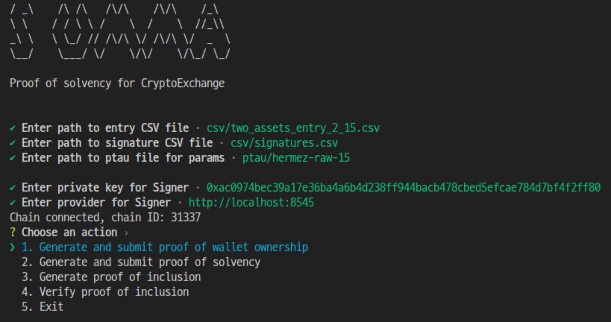

# Summa Playground

Summa Proof of Solvency CLI

This project provides a CLI application for generating and verifying proofs of solvency and ownership for a Centralized Exchange (CEX).
The CLI app interacts with the Summa verifier contract for proof submission and verification.
It's also capable of demonstrating how proofs for each user can be created and subsequently verified off-chain.



## Features

- Generate and Verify Proof of Wallet Ownership: This feature enables a CEX to generate and submit proof to the on-chain verifier contract, confirming the ownership of a specific address.

- Generate and Verify Proof of Solvency: This function empowers the CEX to generate and provide proof to the on-chain verifier contract, verifying that they hold sufficient assets to meet their liabilities.

- Generate Proof of Inclusion: This operation allows the CEX to generate proofs that a particular entry is part of a data set(snapshot) and export this proof for the user.

- Verify Proof of Inclusion: This feature enables the User, who has received the proof from the CEX, to authenticate it off-chain.

## Prerequision

Before executing the CLI application, it's necessary to establish and operate a hardhat node with a deployed Summa verifier contract and Mock ERC20 for testing. This hardhat node should be ready with a specific balance amount.

For your convenience, a Docker image for testing has been uploaded. It can be easily run using the following commands:

```
> docker pull sifnoc/summa-smart-contract:v0.1
> docker run -p 8545:8545 sifnoc/summa-smart-contract:v0.1
```

If you're interested in delving deeper into the test chain, please refer to the branch [summa-playground/cli-app-with-hardhat]https://github.com/summa-dev/summa-playground/tree/cli-app-with-hardhat/contracts."
